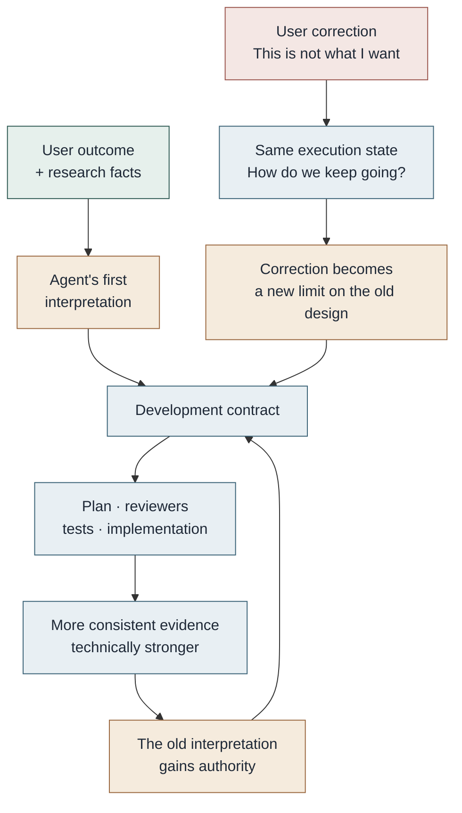
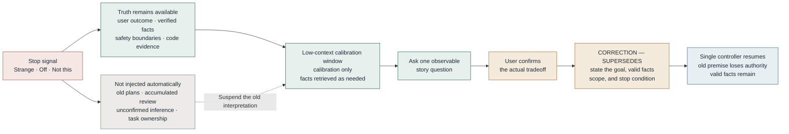

# Let the Agent Forget Some Things So It Can See the Goal Again

*2026-08-18*

> A comprehensive research brief can help an Agent produce a strong development contract. It can also freeze the Agent's first misreading into a long-lived goal. This essay uses a composite story to explain why repeated corrections can be absorbed by the old solution, and how a revocable contract, mechanical stop signals, and a low-context calibration window can preserve project truth, unbind an outdated interpretation, and return a corrected goal to the single execution owner.

The following is a fictional composite story.

A team is rebuilding a file-processing module. The user wants a long file to resume from the last completed point after an interruption. Every completed step should also remain traceable. To prepare the work, the user gives an Agent a detailed research brief containing the current system, failure cases, data boundaries, several possible methods, and a number of unresolved questions.

This is a large request. The Agent does not start coding immediately. It first turns the report into a development contract.

The contract clarifies the goal, boundaries, stages, and acceptance conditions. Sub-agents begin researching. Reviewers examine recovery, consistency, and cancellation. The work is divided into executable batches. For a while, everything becomes easier to see.

But during that first pass, the Agent performs one extra translation. It reads "a long file must be resumable" as "build a general workflow system that can schedule many kinds of file jobs." These ideas are not unrelated. The second design can even satisfy the first requirement very well. It simply contains a larger world than the user asked for.

The user corrects it more than once: "This feels overengineered. I need file recovery, not a platform."

The Agent hears the correction. It removes extension points, limits the job types, narrows the interfaces, and then continues building the workflow system.

The correction has not changed the direction. It has become another constraint inside the old direction.

## The contract did not fail. It simply acquired too much authority.

Without a development contract, a large task really can drift. A conversation about performance becomes a performance project. The next question concerns permissions, and permissions take over the task. Different Agents retain different fragments, and everyone works carefully without working on the same thing.

A contract gives a long task solid ground. The problem is that it often preserves more than the user's goal. It also preserves the Agent's first interpretation of that goal.

In a chat, a misreading is still only a misreading. Once it enters the contract, it gains headings, acceptance criteria, and a plan. Reviewers search for risks inside its premise. Tests prove that it can run reliably. Implementation produces more facts that support it. Each step is reasonable on its own. Together, they form a loop.

When the user corrects the direction again, the controller is no longer facing a sentence. It is facing an internally coherent world. The easiest move is not to discard that world, but to add one more rule to it.

*Figure 1. Once an interpretation enters the contract, planning, review, and implementation continue producing evidence for it. If a correction is treated only as another limit, the old goal becomes more complete instead of being confirmed again.*

This is why engineering verification cannot prove goal alignment by itself. Passing tests show that the current contract was implemented reliably. A strong review shows that the stated problem can be examined seriously. Neither proves that the first question was the question the user meant to ask.

The easy thing to miss here is not model capability. It is the authority of an interpretation. A research brief contains verified facts, a desired user outcome, candidate methods, and genuine unknowns. They should not acquire equal authority merely because they appear in the same document. Facts may challenge a method, but they cannot invent a new goal. A technical discovery may force us to change routes, but it cannot quietly choose the destination.

## Why repeated corrections still fail

The controller did not miss the words "overengineered." It was still operating in execution state.

It owns the current contract, task progress, reviewer feedback, and existing implementation. That state naturally asks one question: **How can the current solution continue?** The user's negative judgment is therefore translated into an optimization request: remove a layer, narrow an interface, add a counterexample.

But the user's actual question may be: **Is this solution still solving the original problem?**

The difference is small in language and large in consequence.

Long tasks amplify it. Sub-agents and reviewers usually receive their premise from the controller. Plans, decisions, and review documents then become the current truth for later windows. If the first premise is wrong, more high-quality collaboration does not necessarily create more independent judgment. It may simply converge faster on the same premise.

The study *How Memory Management Impacts LLM Agents* calls a related pattern **experience-following**: when a retrieved memory closely resembles the current input, the Agent is more likely to produce a similar output, and errors from earlier experience can propagate. The paper does not establish the cause of the composite story above. It does, however, remind us that memory is not a neutral archive. What is retrieved repeatedly starts to look like the natural next step.

This means that "this feels strange," "the direction is off," "that is not what I mean," or "I cannot see why we need this" should count as valid evidence even when the user cannot supply the correct architecture term. These statements do not prove that the user already knows the answer. They do show that the current interpretation should stop acquiring new authority.

At that point, more explanation rarely helps. The work should stop first.

## Forget the authority of the old interpretation, not the facts

Forgetting here does not mean deleting the repository, erasing the conversation, or forcing the model to start from nothing.

OpenAI's *Harness Engineering* treats a short entry document as a map and lets the Agent retrieve repository truth as needed. Anthropic's *Effective Context Engineering for AI Agents* also discusses just-in-time retrieval, compaction, and focused work in isolated contexts. These practices control what the model sees in the current turn.

Agent-memory research asks a second question: what should remain eligible to influence the Agent later? *Memory-R1* trains a memory manager to choose among adding, updating, deleting, and doing nothing. *Oblivion* describes forgetting as reduced accessibility rather than necessarily as physical deletion.

The pattern in this essay does not implement learned decay or long-term memory governance. It does something smaller. During one calibration episode, it withholds old plans, accumulated review, and unconfirmed inference from the active context. Code, contracts, safety boundaries, and runtime facts remain available from authoritative sources when they are needed.

One other change matters just as much: the Agent doing the calibration does not own implementation.

The controller is in execution state, so it naturally thinks about how to continue. A calibration window has no progress, commit, or delivery responsibility, so it can ask whether the premise still holds. The underlying model may be identical. The Harness gives it a different active context, role, and authority, and it therefore approaches the same problem from a different position.

Low context is an information diet, not amnesia. Removing the force of speculative history is a feature. Losing durable project truth would be a defect.

*Figure 2. Calibration does not delete project truth. It suspends the old interpretation and its task state, exposes only the minimum necessary facts, and returns a corrected contract to the single controller after the user confirms the tradeoff.*

## What "this is overengineered" does in two different windows

Return to the file-recovery story.

If we give the full plan, reviewer history, and existing implementation to another execution window, it may propose keeping the workflow engine while removing plugins, or keeping the scheduler while exposing only one job type. These may be good suggestions. They still assume that the engine must exist.

A clean calibration window receives less: the user's current concern, the controller's latest explanation, the current contract, and the minimum code facts required to decide the question. It does not take over the task. It explains in plain language what the controller is doing, then asks one observable question that would actually change the route:

> After the computer restarts, does the user only need to reopen this one file and continue from the last completed point? Or must many different jobs be queued, scheduled, and made dependent on one another?

The user confirms the first story. No one needs to make the user choose among "workflow engine," "state machine," or "checkpoint protocol." The calibration window can now write the correction: preserve resumability, traceability, and safe writes; remove general job scheduling from the approved premise; ask the controller to find the smallest method that satisfies single-file recovery.

The calibration window is not smarter than the controller. It simply did not inherit the commitment that the engine had to exist, and it did not inherit the responsibility to finish it.

We still cannot attribute the effect to low context alone. The pattern changes both active context and task state, and we have not isolated their individual contributions. Nor does it imply that less context is always better. Ordinary implementation needs rich code and project context. Pruning becomes useful when an old interpretation has already acquired path dependence.

## Building the same mechanism into an Agent Harness

A calibration window is a repair mechanism. The more important task is to make the goal correctable from the beginning, rather than letting every later correction become an append-only clause.

### Separate the goal from its interpretation

Before a long task begins, the development contract should separate at least these fields:

> **User outcome:** What must ultimately happen.
>
> **Approved method and scope:** How the work is currently allowed to proceed.
>
> **Done when:** What evidence counts as completion.
>
> **Explicit non-goals:** Which nearby outcomes do not belong to this task.
>
> **Unknowns:** What still requires evidence and cannot be filled in automatically by the Agent.

Give every non-trivial interpretation a status: `PROVISIONAL` or `CONFIRMED`. An unconfirmed architecture, plan, or reviewer premise remains a revocable hypothesis no matter how complete it looks.

One successful story and at least two literal counterexamples are often more useful than asking the user to select unfamiliar technical terms. Before technical review begins, reviewers should be able to restate those stories. If they cannot restate them unambiguously, they do not yet know which question they are reviewing.

### Turn negative judgment into a mechanical stop signal

When the user says "off," "not this," "strange," "confusing," or "I cannot follow this," the controller should stop adding work and stop closing the task. It should not jump automatically to the opposite solution either. It should first state four things:

1. The last user outcome that was actually confirmed.
2. The interpretation the controller is currently using.
3. The difference between them.
4. The contracts, tasks, reviews, or implementation already affected.

Then ask one observable question. The answer must change the next branch. If every possible answer leads to the same method, it is not the question that matters now.

### Open a clean calibration window when the controller cannot unbind itself

The calibration window needs one durable role instruction. It does not need a handoff from the previous calibration window:

> You are a low-context technical advisor, not the project controller. Explain in plain language what the controller is trying to do, help the user identify the real tradeoff, and turn the user's confirmed judgment into one precise task for the controller. Reconstruct context only from this role, the user's current question, the controller's latest relevant response, and the minimum authoritative evidence required to answer. You do not implement, accept, merge, release, publish, or change the goal on your own.

At startup, provide only the current user question and the controller's latest relevant response. The calibration window may read the contract, code, Git history, or runtime evidence when needed. It should not begin by inheriting old plans, accumulated reviewer history, a predecessor window's inference, or task state.

Reading less is not the goal. It is how the old interpretation loses its automatic right to speak first.

### Return one corrected contract

The endpoint is not a second research report. It is one stable task that can go directly back to the controller:

> **STATUS:** CORRECTION — SUPERSEDES `<old premise>`
>
> **CONFIRMED USER OUTCOME:** `<what must ultimately happen>`
>
> **VALID FACTS:** `<code, runtime, and safety evidence that still holds>`
>
> **REQUIRED RESULT:** `<the next observable result the controller must produce>`
>
> **OUT OF SCOPE:** `<old interpretation, optional improvements, and unconfirmed preferences>`
>
> **STOP AND RETURN:** `<conditions that require another user decision>`

After receiving the correction, the controller removes authority from the old premise and the work derived from it, while preserving facts that remain valid. Before implementation resumes, it performs a goal diff: every file, test, and task that continues must map back to the corrected user outcome. A green build cannot replace this check.

## What this pattern does — and does not — solve

It is useful for large requests, long-running tasks, and work that has already accumulated contracts, reviews, and multiple Agent windows. A small edit does not need this ceremony. If the user's correction can stop the controller directly, there is no reason to open a calibration window.

It is not a second controller and not a new multi-Agent framework. Task state, implementation, acceptance, and release still have one owner. The calibration window is an independent reasoning surface: it helps the user see the problem, then sends the decision back into the execution chain.

It does not guarantee that the calibration window is right. Low context can omit decisive facts, so authoritative project truth must remain available on demand. The window produces advice; only a user-confirmed decision can change the goal. Technical facts may challenge the method, but they cannot quietly choose the outcome for the user.

I now prefer to treat a long-running development contract as a revocable interpretation, not as the goal itself. It must be stable enough for many Agents to work together. It must also retain a seam through which one sentence — "this is not what I want" — can genuinely stop it.

The goal should live for a long time. Our first interpretation of it does not deserve the same lifespan.

## References

- [How Memory Management Impacts LLM Agents: An Empirical Study of Experience-Following Behavior](https://aclanthology.org/2026.acl-long.27/)
- [OpenAI: Harness engineering](https://openai.com/index/harness-engineering/)
- [Anthropic: Effective context engineering for AI agents](https://www.anthropic.com/engineering/effective-context-engineering-for-ai-agents)
- [Memory-R1: Enhancing Large Language Model Agents to Manage and Utilize Memories via Reinforcement Learning](https://aclanthology.org/2026.acl-long.583/)
- [Oblivion: Self-Adaptive Agentic Memory Control through Decay-Driven Activation](https://arxiv.org/abs/2604.00131)
