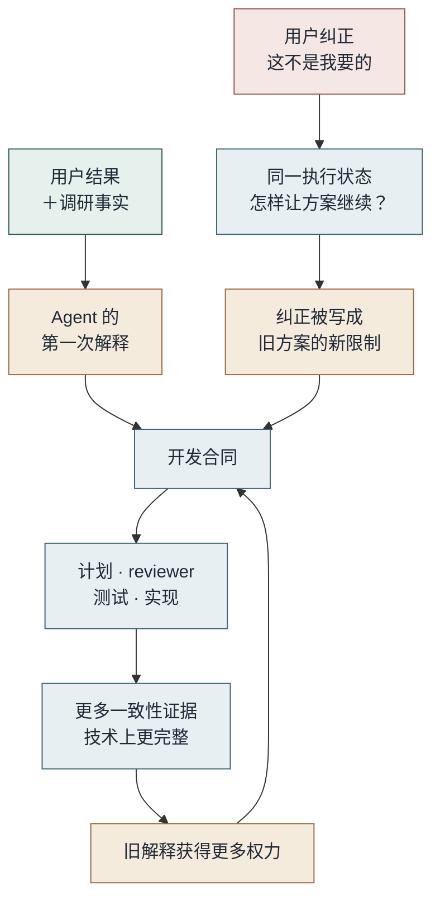
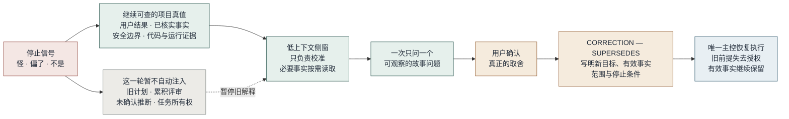

# 让 Agent 忘掉一些东西，才能重新看见目标

*2026-08-18*

> 完整调研报告让 Agent 写出开发合同，也可能把第一次误读固定成长期目标。本文用一个组合故事解释：为什么反复纠正仍会被旧方案吸收，以及怎样通过可撤销合同、停止信号和低上下文侧窗，保留项目真值，解绑旧解释，再把准确目标交回唯一主控。

下面是一个虚构的组合故事。

一支团队准备改造文件处理模块。用户希望一个很长的文件在处理中断以后，可以从已经完成的位置继续；每一步产生了什么结果，也应该能够追查。为此，他交给 Agent 一份完整调研报告。里面有现状、失败案例、数据边界、几种实现方法和不少仍未确定的地方。

这是一个大需求。Agent 没有立刻写代码，而是先把报告整理成开发合同。

合同补齐了目标、边界、步骤和验收条件。随后，sub-agent 开始研究，reviewer 检查恢复、一致性与取消，任务也被拆成了可以执行的批次。事情一度变得很清楚。

只是 Agent 在第一次整理时，多做了一次翻译。它把“一个长文件能够恢复”理解成了“建立一套可以调度各种文件任务的通用工作流”。这两件事并非毫无关系。后一种方案甚至可以很好地完成前一种需求。它只是多拥有了用户没有要求的世界。

用户后来不止一次纠正：“这好像做复杂了。我需要的是文件恢复，不是一套平台。”

Agent 也听见了。它减少扩展点，限制任务类型，收紧接口，然后继续完善那套工作流。

于是，纠正没有改变方向。它变成了旧方向的新约束。

## 合同没有做错，它只是拥有了过高的权力

如果没有开发合同，大任务确实容易漂移。当前对话在谈性能，性能就接管目标；下一轮追问权限，权限又成为主线。不同 Agent 各自记住一部分，最后都很认真，却不再做同一件事。

合同给长任务铺了一块地面。问题在于，合同保存的往往不只是用户目标，也包括 Agent 对目标的第一次解释。

在聊天里，一次误读还只是一次误读。进入合同以后，它会获得文件名、验收项和计划；reviewer 开始在这个前提下找风险，测试证明它可以稳定运行，实现又产生更多支持它的事实。每一步单独看都合理，合起来却会形成一个回环。

用户再次纠正时，主控面对的已经不再是一句话，而是一整套内部一致的世界。它最自然的动作不是推翻这个世界，而是为它增加一条规则。

*图一：第一次解释进入合同后，计划、评审和实现会继续为它生产证据。如果用户纠正只被当作新增限制，旧目标会变得更完整，而不是被重新确认。*

这也是为什么工程验证无法单独证明目标正确。测试通过，只能说明当前合同被稳定实现；reviewer 给出强答案，只能说明这个问题可以被严肃地回答。它们都不能反过来证明，最初那道题就是用户要问的题。

我觉得这里最容易忽略的，不是模型能力，而是解释的权力。调研报告里的事实、用户要得到的结果、候选方法和仍为 Unknown 的地方，不应该因为被写进同一个文档就拥有同样地位。事实可以挑战方法，不能自行创造目标；技术发现可以迫使我们换路，不能偷偷决定终点。

## 反复纠正为什么仍然没有生效

主控并不是没有看到“做复杂了”。它只是仍处于执行状态。

它拥有当前合同、任务进度、reviewer 意见和已经产生的实现。这个状态会自然地提出一个问题：**怎样让当前方案继续？** 用户的负向判断于是被解释成优化意见——减少一层、收紧一个接口、补充一个反例。

但用户实际提出的问题可能是：**当前方案还在解决原来的问题吗？**

这两个问题只差一点，后果完全不同。

长任务还会放大这种差异。sub-agent 与 reviewer 通常从主控取得题目；计划、决策和评审文档又被后续窗口当作当前真值。如果最初前提偏了，更多高质量协作未必带来更多独立判断，也可能只是更快地在同一个前提上收敛。

《记忆管理如何影响 LLM Agent》是一项关于长期 Agent 的实证研究。它把相似现象称为 experience-following，也就是“经验跟随”：被取回的相似经验会持续影响后续行为，错误经验也可能因此传播。这项研究不能证明本文故事里的因果，但它提醒我们，记忆不是一间中性的仓库。被反复取回的东西，会逐渐变成 Agent 眼中更自然的下一步。

所以，“怪”“偏了”“不是这个”“我看不懂为什么要这样做”，即使没有附带正确的架构术语，也应该被当成有效证据。它们未必说明用户已经知道答案，却足以说明当前解释需要停止取得新权力。

这时继续解释，通常没有帮助。应该先停。

## 需要忘掉的不是事实，而是旧解释的支配力

这里说的遗忘，不是删除仓库，不是抹掉聊天，也不是让模型从零开始。

OpenAI 在《Harness Engineering》里把短小的入口文档当作地图，让 Agent 按需回到仓库真值。Anthropic 的《为 AI Agent 做有效的上下文工程》也讨论了即时取回、压缩和隔离的聚焦上下文。这些方法在控制“本轮让模型看见什么”。

Agent 记忆研究还在追问另一件事：什么以后仍有资格影响它。《Memory-R1》让记忆管理器在增加、更新、删除与不处理之间选择；《Oblivion》则把遗忘描述为可达性的降低，而不一定是物理删除。

本文的方法没有做到这些研究里的学习、衰减或长期记忆治理。它做的是一件更小的事：在一次目标校准里，暂时不把旧计划、累积评审和未确认推断送进当前注意力；需要的代码、合同、安全边界和运行事实，仍然从权威来源按需读取。

还有一个变化同样重要：负责校准的 Agent 不拥有实现任务。

主控处于执行状态，默认想的是怎样继续。侧窗没有进度、提交和交付责任，默认可以先问前提是否成立。底层模型可能完全相同，但 Harness 给它们的活动上下文、角色和权限不同，它们会从不同位置看同一个问题。

低上下文在这里是一种信息节食，不是失忆。丢掉推测历史的支配力是功能；丢掉持久真值则是缺陷。

*图二：校准不会删除项目真值。它暂停旧解释及其任务状态，只让最小必要事实进入侧窗；用户确认取舍后，侧窗把纠正合同交回唯一主控。*

## 同一句“做复杂了”，在两个窗口里会发生什么

回到文件恢复的故事。

如果把完整计划、reviewer 历史和现有实现交给另一个执行窗口，它很可能提出：保留工作流引擎，但减少插件；保留调度器，但只开放一种任务。这些建议可能都不错，只是仍然默认引擎必须存在。

干净侧窗得到的材料更少：用户当前的困惑、主控最近一次解释、现行合同，以及确认问题所需的最小代码事实。它不接管任务，只用白话说明主控正在做什么，然后问一个会改变路线的故事问题：

> 电脑重启以后，用户只需要重新打开这一个文件，从上次完成的位置继续；还是还需要让许多不同任务排队、调度和互相依赖？

用户确认是前一种。到这里，不需要再让用户选择“工作流引擎”“状态机”或“检查点协议”。侧窗已经可以写出纠正：保留可恢复、可追查和安全写入这些结果；取消通用任务调度作为获批前提；由主控重新评估满足单文件恢复所需的最小方法。

这不是侧窗比主控聪明。它只是没有继承“引擎必须存在”这项承诺，也没有继续完成它的责任。

现在还不能把效果只归因于少上下文。侧窗同时改变了活动上下文和任务状态，我们并没有把两者拆开测试。也不能因此推导出“上下文越少越好”。普通实现仍然需要丰富的代码和项目事实；只有当旧解释已经形成路径依赖时，裁剪才有意义。

## 把同样的机制装进自己的 Agent Harness

侧窗只是补救。更重要的是，让目标从一开始就可以被纠正，而不是一旦写进合同便只能追加。

### 先把目标与解释分开

长任务开始前，开发合同至少要分开写这些内容：

> **用户结果：** 最终要看到什么发生。  
> **获批方法与范围：** 目前允许怎样做。  
> **完成条件：** 什么证据才算结束。  
> **明确不做：** 哪些看似相近的结果不属于当前任务。  
> **Unknown：** 仍需取证，不能由 Agent 自动补齐的地方。

对非平凡解释再加一个状态：`PROVISIONAL` 或 `CONFIRMED`。未经用户确认的架构、计划和 reviewer 前提都只是可撤销假设，不能因为写得完整就自动升级。

用一个成功故事和至少两个字面反例检查合同，比让用户选择陌生术语有效。reviewer 开始技术审查前，也应先复述这三个故事；如果无法唯一复述，就说明它还不知道自己在审哪一道题。

### 把负向判断变成机械停机信号

当用户说“偏了、不是、很怪、混沌、看不懂”时，主控不要继续收尾，也不要立刻跳到相反方案。先只写四件事：

1. 用户最后确认的结果；
2. 主控当前采用的解释；
3. 两者出现了什么差异；
4. 哪些合同、任务、评审或实现已经受到影响。

然后一次只问一个可观察的问题。问题必须会改变下一条路线；如果无论用户怎样回答都不改变方法，它就不是此刻该问的问题。

### 主控解绑失败时，再打开干净侧窗

侧窗需要一份长期角色说明，但不需要继承前一个侧窗的 handoff：

> 你是低上下文技术顾问，不是项目主控。你负责用白话解释主控正在做什么，帮助用户辨认真正的取舍，并把用户确认的判断写成一项精确任务交回主控。你只从当前问题、主控最近回复，以及回答所需的最小权威证据重建上下文。你不实现、不验收、不合并、不发布，也不能自行改变目标。

启动时只提供用户当前问题和主控最近一次相关回复。侧窗可以按需读取合同、代码、Git 或运行证据，但不先吞下旧计划、累积 reviewer 历史、前任侧窗推断和任务状态。

少读不是目的。它只是为了让旧解释不再自动获得发言顺序。

### 最后只回传一份纠正合同

侧窗的终点不是第二份研究报告，而是一项可以直接交给主控的任务：

> **STATUS:** CORRECTION — SUPERSEDES〈被取代的旧前提〉  
> **用户确认的结果：**〈最终要看到什么发生〉  
> **仍然有效的事实：**〈代码、运行与安全证据〉  
> **下一步所需结果：**〈主控必须得到的可观察结果〉  
> **明确不做：**〈旧解释、可选完善与未确认偏好〉  
> **停止并返回：**〈遇到什么情况必须再次交还用户决定〉

主控收到后，旧前提及其派生工作不再拥有继续授权，但其中仍然有效的事实可以保留。恢复实现以前，再做一次目标差异检查，也就是 goal diff：每一个继续修改的文件、测试和任务，都要能映射回纠正后的用户结果。绿灯不能替代这一步。

## 这套方法解决什么，又不解决什么

它适合大需求、长任务，以及已经产生合同、reviewer 和多窗口协作的工作。小改动不需要为此再造一个仪式。用户的纠正能够让主控直接停下来时，也没有必要打开侧窗。

它不是第二个主控，更不是新的多 Agent 框架。任务状态、实现、验收与发布仍然只有一个 owner。侧窗只是一次独立的推理表面：它帮助用户看清问题，再把决定送回执行链。

它也不保证侧窗一定正确。低上下文可能遗漏决定性事实，所以权威项目真值必须可以按需读取；侧窗形成的仍然只是建议，只有用户确认的决定才能改变目标。技术事实可以挑战方法，但不能偷偷替用户选择结果。

现在，我更愿意把长任务合同看成一份可以撤销的解释，而不是目标本身。它需要足够稳定，才能让许多 Agent 共同工作；也需要保留一个接缝，让一句“这不是我要的”能够真正使它停下来。

目标应该长期存在。至于我们第一次怎样理解它，不必享有同样长的寿命。

## 参考资料

- [How Memory Management Impacts LLM Agents: An Empirical Study of Experience-Following Behavior](https://aclanthology.org/2026.acl-long.27/)
- [OpenAI：Harness engineering](https://openai.com/index/harness-engineering/)
- [Anthropic：Effective context engineering for AI agents](https://www.anthropic.com/engineering/effective-context-engineering-for-ai-agents)
- [Memory-R1: Enhancing Large Language Model Agents to Manage and Utilize Memories via Reinforcement Learning](https://aclanthology.org/2026.acl-long.583/)
- [Oblivion: Self-Adaptive Agentic Memory Control through Decay-Driven Activation](https://arxiv.org/abs/2604.00131)
