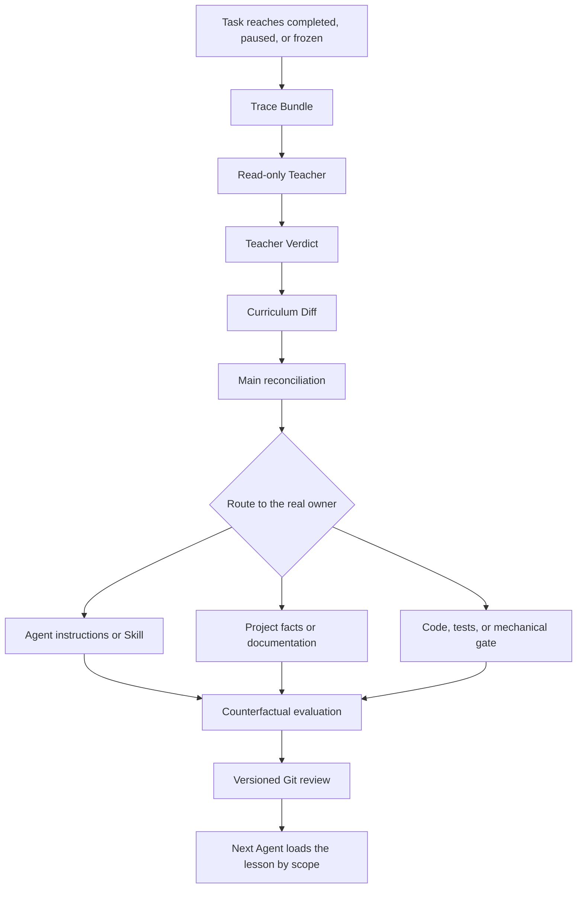
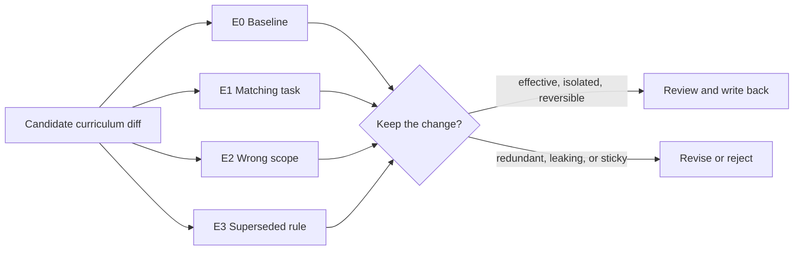

# Compiling One Task into the Next Agent's Rules

*2026-08-27 · Agent memory · coding agents · context engineering · evaluation · human-in-the-loop*

> A completed task leaves behind code, tests, plans, and conversation. It does not automatically leave behind a useful lesson. This essay describes a small correction loop: a read-only Teacher reviews the decisive parts of a finished task, proposes a scoped instruction diff, and sends that diff through ordinary evaluation and Git review before another Agent can inherit it.

There is a peculiar kind of forgetting in coding agents.

A task ends. The repository still contains the code and tests. The conversation still contains the user's corrections: “this is drifting from the result,” “the validation tool has become the goal,” or “you are optimizing the adjacent metric.” The next task has a similar shape, yet the Agent repeats the same move.

Nothing was deleted. The experience simply failed to become an executable rule.

Most agent systems already have some form of memory. The missing component is often a compiler: a process that turns a finished task into a small, reviewable change in future behavior.

We call this process a **Teacher backsweep**.

## An external baseline appeared at the right time

While we were formalizing this method, Anthropic published [a case study on Warp's self-improving agents](https://claude.com/blog/how-warp-builds-self-improving-agents-on-claude).

Warp had a concrete problem. Its code-review agent sometimes produced unhelpful comments, while engineers supplied detailed corrections in issues and pull requests. Manual prompt edits could improve the next few reviews, but the feedback disappeared with the session.

Warp built a two-Skill loop. A base Skill performs the work. An outer improver periodically reads human feedback and proposes a small edit to that base Skill. Because Skills are files, the proposed change can move through the normal pull-request workflow: diff, review, approval, and merge. The next run inherits only what people accepted.

That pattern establishes an important baseline:

```text
Base Skill -> human feedback -> Improver Skill
           -> focused file diff -> human review -> next run
```

The engineering gain comes from giving feedback a durable and reviewable path. The improver does not silently rewrite production behavior. Humans still decide what enters the next run.

Our starting question was slightly different. We wanted to learn from task trajectories that contained goal drift, scope errors, obsolete rules, and validation work that had begun to govern the product. The resulting loop shares Warp's file-based shape, then adds explicit contracts for causality, scope, ownership, and exit.

## The shape we borrowed from Dream Memory

An earlier read-only experiment gave us the initial shape. A separate Teacher reviewed a small set of completed experiences, compared user corrections with later choices and results, and proposed candidate lessons. It did not participate in normal task execution and had no authority to edit user memory.

“Dream” is a metaphor here. The mechanism does not model human sleep or claim that an Agent learns in the way a brain does. The useful shape is simpler:

```text
experience ends
    -> replay a few decisive fragments
    -> discard most process noise
    -> consolidate repeated causes into a lesson
    -> reactivate the lesson only in a matching situation
```

The experiment exposed a boundary that later became central to the coding workflow:

> A Teacher may reuse the same grading method across tasks. Its curriculum still needs a precise scope.

A preference discovered during open-ended research should not govern a narrow bug fix. A release discipline required by one repository should not automatically appear inside every local script. The grading mechanism can be shared; the lessons cannot share authority by default.

## The Teacher backsweep

Let `task_trace` denote a closed task and `current_instructions` denote the current durable instruction set.

A common summary workflow behaves like this:

```text
next_instructions = current_instructions + task_summary
```

This tends to mix the desired result, temporary interpretations, task state, and reusable experience.

The backsweep instead asks for a minimal candidate change:

```text
candidate_diff = compile(task_trace, current_instructions)
```

The instruction set changes only after scope checks and evaluation:

```text
next_instructions = apply(current_instructions, validated_diff)
```

The full path is shown below.



*Figure 1. The Teacher proposes a change. The execution owner chooses its destination, verifies its behavior, and controls writeback.*

This resembles Warp's inner/outer Skill loop, with four additional questions:

1. Did the Agent optimize the wrong goal even when the output looked strong?
2. Should this experience change any durable rule at all?
3. Which artifact actually owns the lesson?
4. Can the lesson remain inactive outside its scope and leave when it becomes obsolete?

The rest of the design follows from those questions.

## Contract one: what the Teacher reads

A Teacher should not inherit an entire long conversation by default. Old plans, reviewer explanations, and implementation history can reproduce the same interpretive momentum that shaped the original task.

We reduce the active context to a **Trace Bundle**:

```yaml
task:
  state: completed          # completed | paused | frozen

goal_lock:
  desired_result:
    - an interrupted import can continue after restart
  completion_conditions:
    - confirmed records are never written twice
    - existing validation rules remain unchanged
  explicit_non_goals:
    - throughput optimization
    - task priorities

corrections:
  - the plan concentrated on concurrency and speed
  - the user redirected it toward recovery and idempotent writes

result:
  accepted:
    - processing resumes from the confirmed checkpoint
    - completed records are not duplicated
  unresolved:
    - large-scale throughput remains unknown

evidence:
  - ref: restart-story-test
    proves: processing resumes after restart
  - ref: idempotency-test
    proves: completed records are not written twice

instruction_base:
  version: "sha256:..."
```

This bundle retains six kinds of information:

- the last confirmed result;
- the approved scope;
- completion conditions;
- explicit non-goals;
- user corrections;
- evidence capable of changing the conclusion.

The complete trace remains available for targeted lookup. It simply loses the privilege of occupying the Teacher's attention before a question requires it.

Discarding unconfirmed interpretation is useful. Discarding authoritative project facts would be a defect.

## Contract two: what the Teacher returns

Phrases such as “understand requirements better” and “avoid overengineering” belong in retrospectives. They contain no trigger and prescribe no observable action.

The Teacher must produce a structured verdict:

```yaml
observed_gap:
  expected:
    - verify continuity after a restart
  optimized_instead:
    - concurrency
    - throughput

causal_pattern:
  trigger:
    - the user describes an outcome in ordinary language
    - planning starts to revolve around an adjacent technical metric
  cause:
    - a background condition became a new product goal
    - later tests reinforced that interpretation
  future_action:
    - lock one success story and two literal failure examples before planning
    - map every new completion gate to a confirmed result
  literal_counterexample:
    - every throughput test passes, yet the task cannot resume after restart

scope:
  recommended: repository-wide

evidence:
  level: high

unknowns:
  - this trace cannot establish that every queue design causes goal drift
```

A durable lesson needs at least four parts:

1. a situation that activates it;
2. an action the Agent should change;
3. a similar-looking case where the lesson does not apply;
4. a list of conclusions still unsupported by evidence.

The verdict exists to extract a cause that can change future behavior. Rephrasing the final result adds little value.

## Contract three: the curriculum is a diff

An improver that only appends rules will eventually turn its instruction files into an archive of old anxiety.

The Teacher may therefore propose only five operations:

| Operation | Meaning |
|---|---|
| `PRESERVE` | The existing lesson remains supported and correctly scoped. |
| `UPDATE` | The causal pattern still holds, while its scope or action needs correction. |
| `MERGE` | Several lessons describe the same behavior and should become one. |
| `REMOVE` | The lesson is obsolete, biographical, or unsupported. |
| `NO_CHANGE` | The task exposed no durable gap. |

A candidate diff may look like this:

```yaml
curriculum_diff:
  base_version: "sha256:..."
  operation: UPDATE

  destination:
    owner: AGENTS.md
    section: Goal alignment

  trigger: >
    A new plan item, test, or completion gate cannot name the
    confirmed user result it protects.

  action: >
    Before continuing, list the confirmed result, the current
    proxy condition, and their difference. A condition with no
    mapping cannot block completion.

  counterexamples:
    - longer runtime alone does not prove isolation failure
    - shorter output alone does not prove a business error

  evidence:
    level: high

  unknowns:
    - a separately approved performance goal remains valid
```

`base_version` prevents a stale Teacher result from overwriting newer instructions. Before applying the diff, the main controller rereads the destination. Any intervening change forces reconciliation.

## Route the lesson to the artifact that can enforce it

The Teacher can identify a reusable lesson. The main controller decides which artifact owns it.

| Lesson | Likely owner |
|---|---|
| A stable collaboration preference for one person | User-scoped curriculum |
| A method for one class of work | Workstream instruction or Skill |
| A cross-project collaboration principle | Global Agent instructions |
| An architecture fact for the current repository | Project documentation |
| Permission, isolation, or atomicity | Code, tests, or mechanical gates |
| Current task state | Task record or current session |
| Live business or runtime facts | Current authoritative data source |

This routing step separates the backsweep from a pure Skill rewriter.

Consider the statement: “Stopping task A must never stop task B.” That is a runtime identity boundary. Code and isolation tests should enforce it. A reminder in a Skill is too weak.

Now consider: “When the user says the direction is off, stop extending the current explanation.” That is collaborative behavior. Agent instructions are a suitable owner.

Some lessons should remain available to the Agent. Other lessons should become system properties that survive even when the Agent forgets.

## Evaluate effect, isolation, and exit

A lesson that improves one replay can still harm the surrounding system. We use four minimal evaluation groups:

| Group | Question |
|---|---|
| `E0` No lesson | Does the same model already behave correctly without the proposed change? |
| `E1` Correct scope | Does the lesson reduce the target failure in matching tasks? |
| `E2` Wrong scope | Does the lesson remain inactive in another project or workflow? |
| `E3` Obsolete lesson | Can a newer user decision make the Agent stop using it? |



*Figure 2. A curriculum change earns durability only when it changes the intended behavior, stays within scope, and yields to newer evidence.*

The three properties are **effect**, **isolation**, and **exit**.

If `E0` already passes consistently, the new lesson is redundant. If `E2` fails, the curriculum is leaking across scopes. If `E3` fails, old experience will eventually overpower new decisions.

Warp's case study makes a related point: feedback may be wrong, so the system should assume that risk exists. A person filters the feedback or reviews the final change, and ordinary pull-request controls keep the update inspectable.

## A first version needs no new platform

The smallest useful implementation can consist of three file roles:

```text
teacher-contract.md
    read-only role, input contract, and output schema

backsweep-candidate.md
    verdict, curriculum diff, evidence, and unknowns for one task

existing AGENTS.md / Skill / docs / tests
    the real owners that may receive a validated change
```

The operating procedure is short:

1. The main controller marks a task `completed`, `paused`, or `frozen`.
2. It produces a one-page Trace Bundle.
3. A clean, read-only Teacher window generates a verdict.
4. The Teacher proposes one curriculum diff.
5. The main controller rereads current instructions and chooses the owner.
6. It runs deduplication, scope checks, and `E0` through `E3`.
7. A person confirms any non-trivial goal or product boundary.
8. The change moves through a normal Git diff, review, and merge.
9. Later tasks load the lesson only when their scope matches.

We would keep this manual at first. A scheduler, vector store, or automatic writeback becomes useful only after two claims survive evidence:

- the Teacher extracts causes more precisely than an ordinary task summary;
- those causes produce an observable change in a later, similar task.

Automation introduced earlier will preserve noise more efficiently.

## Where the Warp baseline ends and the backsweep begins

Warp presents a clean operational loop:

```text
feedback -> Improver -> Skill diff -> human review -> next run
```

The Teacher backsweep extends the middle of that loop:

```text
goal + correction + result
    -> read-only Teacher
    -> causal verdict
    -> scoped curriculum diff
    -> main reconciliation
    -> correct owner + counterfactual evaluation
    -> versioned writeback
```

The designs address overlapping problems and need not converge into one product. Warp demonstrates that file-based Skills, an independent improver, and human review can form a practical feedback loop. The backsweep concentrates on cases where feedback concerns the direction of a long task: goal drift, scope leakage, stale lessons, and tests that accidentally become product requirements.

Those cases require more than better wording. They require a way to reject a lesson, place it outside the prompt, prove that it stays local, and remove its authority later.

## Self-improvement as configuration maintenance

“Self-improving agent” suggests a system continually growing more capable. The engineering object is more modest. It resembles a specialized configuration-maintenance pipeline:

- task traces supply source material;
- Trace Bundles define the cropped input;
- Teacher Verdicts provide an intermediate representation;
- Curriculum Diffs propose changes;
- the main controller reconciles them with current truth;
- evaluation checks effect, isolation, and exit;
- Git review and version checks control writeback.

Research has already explored several pieces of this space. [Reflexion](https://papers.neurips.cc/paper_files/paper/2023/hash/1b44b878bb782e6954cd888628510e90-Abstract-Conference.html) studies verbal feedback stored for later trials. [ExpeL](https://arxiv.org/abs/2308.10144) extracts knowledge across experiences. [Agent Workflow Memory](https://arxiv.org/abs/2409.07429) investigates reusable workflows. Meanwhile, [work on intrinsic self-correction](https://deepmind.google/research/publications/48252/) shows why reflection without reliable external feedback deserves caution.

These results do not verify the backsweep as a complete system. They support a narrower design choice: generating a reflection and granting that reflection durable authority should remain separate stages.

Dream Memory supplied the shape of selective retention. Replay a small amount of evidence. Remove most of the process. Preserve very few causal lessons. Place each lesson with the owner that can enforce it. Let the next Agent begin with a cleaner active context.

The next Agent does not need to remember the previous conversation.

When it reaches the same risk, it should take a different action.

## References

- [How Warp builds self-improving agents on Claude](https://claude.com/blog/how-warp-builds-self-improving-agents-on-claude)
- [Reflexion: Language Agents with Verbal Reinforcement Learning](https://papers.neurips.cc/paper_files/paper/2023/hash/1b44b878bb782e6954cd888628510e90-Abstract-Conference.html)
- [ExpeL: LLM Agents Are Experiential Learners](https://arxiv.org/abs/2308.10144)
- [Agent Workflow Memory](https://arxiv.org/abs/2409.07429)
- [Large Language Models Cannot Self-Correct Reasoning Yet](https://deepmind.google/research/publications/48252/)
