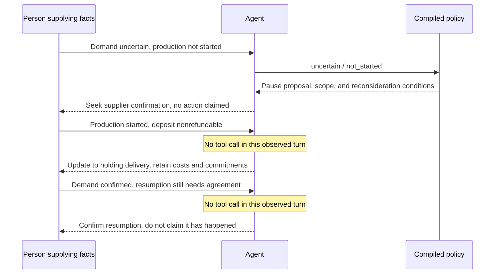
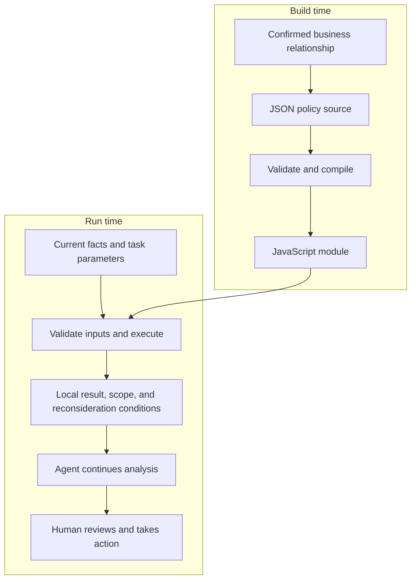

# Compiling Business Experience into Code an Agent Can Use

*2026-09-19 · AI agents · policy compilation · domain-specific languages · tool use · agent evaluation · human-in-the-loop*

> We expressed a set of confirmed business rules as JSON policies, compiled them into JavaScript, and made them available to an Agent on demand. Synthetic comparisons preserved the main decision relationships and showed lower elapsed times. This article explains the working path, its evaluation, and how experiments with experience injection, small models, and Jev helped us separate learning a relationship from executing one.

We built a working chain: people confirm a piece of business experience, express it as a structured policy, and compile it into a program. The Agent understands the current question, prepares the inputs, calls the program, and continues its analysis.

For me, that gave earlier work another way to survive into the next task.

From the beginning of the project, we had tried to move established calculations and workflows into scripts. Quantities and dates acquired their own algorithms. A large business tool was broken into capabilities that could be called separately. A product compass introduced later connected these choices: the system keeps facts and state, stable work gradually moves into code, and the model handles what remains unresolved.

Business experience can follow that path, but its representation matters. Put an earlier good answer back into context, and the model still has to interpret it again. When a relationship inside that answer has already been confirmed, we want the next run to be able to execute it.

The implementation is a narrowly scoped policy DSL and compiler. A domain-specific language, or DSL, is a language designed for a particular area of work. Ours uses JSON to describe inputs, conditions, and results, then produces executable JavaScript. It grew from one policy to fourteen local rules using the same compiler. Offline checks covered sixty branch and combined inputs, and some natural-language tool paths also worked.

That establishes a capability. How much work it saves over longer periods remains a separate question. Start with one complete interaction.

## How a piece of experience enters the next task

The order below is synthetic. All business stories and experimental measurements in this article come from synthetic tests, not real orders.

Demand for a batch is still uncertain. The business wants to avoid extending its commitments, while acknowledging costs that have already been incurred. The production stage changes the next step:

| Current facts | Local recommendation from the confirmed policy |
| --- | --- |
| Demand uncertain; production has not started | Propose pausing order progression, subject to confirmation with the supplier |
| Demand uncertain; production has started | Propose holding delivery; whether production should continue is a separate question |
| Demand uncertain; production stage unknown | Confirm the production stage first |
| Demand confirmed | This uncertainty-based pause policy no longer triggers |

The policy does not settle everything. It specifies where a pause recommendation applies under these conditions. Costs, the possibility of negotiating a production stop, and supplier agreement still require work.

In a synthetic test, the Agent received uncertain demand and a confirmed not-started production stage. It independently mapped them to the two policy inputs:

```json
{
  "demand": "uncertain",
  "production": "not_started"
}
```

The generated program returned a proposal to pause order progression, together with its scope, basis, and reconsideration conditions. The Agent incorporated the proposal into its answer. A responsible person still needed to confirm the arrangement with the supplier; a recommendation did not mean the pause was already effective. Existing costs and commitments still needed checking.

A natural-language input, a tool call, and a complete answer had connected. The program did not produce an essay. The model did not have to determine again which confirmed relationship applied to those two states.

We then continued the story.

In the next turn, production had started, and the deposit was contractually nonrefundable. The Agent changed its recommendation to holding delivery. It retained the deposit and existing commitments instead of repeating the earlier recommendation for unstarted production.

In the third turn, demand was confirmed. The supplier had previously agreed to a temporary hold, but resumption still required confirmation. The Agent recognized that the reason for the uncertainty-based pause had disappeared. It recommended confirming the resumption arrangements, without claiming that delivery had already resumed.

One detail matters: **the Agent called the program only in the first turn.** It skipped the tool in the next two and continued with the shared method and new facts. We observed a cooperative path that could move forward as facts changed. We did not observe the program making a fresh decision on every turn.



*The observed three-turn path used the program once. Subsequent updates came from the Agent working with its history and new facts.*

I like this result. The policy supplies a clear basis where needed, while the Agent organizes the remaining work. A local tool does not have to take over the entire conversation.

It also makes the preservation of experience observable: the relationship remains available, current state can change, and real actions still require human confirmation.

## What the program actually preserves

We did not put the entire business explanation inside the compiler. The compiler implements the language; the business relationships live in policy source.

Here is a simplified public representation of the started-production branch:

```json
{
  "when": {
    "demand": "uncertain",
    "production": "started"
  },
  "result": {
    "kind": "proposal",
    "action": "hold_delivery",
    "scope": "Delivery for this batch only; continuing production is a separate decision",
    "basis": "Demand is uncertain, production has started, and existing costs and commitments remain",
    "reconsiderWhen": "Demand, production state, or the supplier response changes"
  }
}
```

`when` declares the conditions; `result` declares what the relationship returns. The result includes scope and reconsideration conditions alongside the action. Those meanings need to travel with the decision into the next model request.

Compilation turns this into ordinary JavaScript comparisons and returns. The branch has this shape:

```javascript
if (facts.demand === "uncertain" &&
    facts.production === "started") {
  return {
    kind: "proposal",
    action: "hold_delivery",
    scope: "Delivery for this batch only; continuing production is a separate decision",
    basis: "Demand is uncertain, production has started, and existing costs and commitments remain",
    reconsiderWhen: "Demand, production state, or the supplier response changes"
  };
}
```

This is an illustrative generated branch. The complete module also validates inputs. Execution requires neither a model nor another interpretation of the policy source.

A narrow language makes some checks tractable. Demand and production stages accept only declared values. `null` means unknown; the string `"null"` is invalid input. Before compilation, we check field references, value domains, and rule overlap. “Demand uncertain” overlaps with “demand uncertain and production started,” for example. The implementation rejects that pair rather than allowing source order to decide the business meaning.

Our overlap check is conservative. It proves disjointness through contradictory equality conditions; it is not a general solver for complicated numeric intervals. Field names are constrained, result text is emitted as string literals, and policies cannot embed arbitrary JavaScript.



*The source declares the relationship. Runtime facts and parameters determine which result applies now. The program returns advice, not a business action.*

Changes also acquire specific locations.

For a coverage-days example, demand was confirmed and current coverage was 25 days. The same generated function received thresholds of 20, 30, and 25. A strict less-than comparison returned not triggered, triggered, and not triggered. These were synthetic verification values, not operational replenishment standards. Changing the threshold required no recompilation.

Changing a relationship means editing the policy source and generating the program again. In a synthetic copy, we exchanged two branch conditions while leaving the compiler unchanged. The corresponding behavior swapped; the other combinations stayed the same. That tests faithful compilation. A bad business policy can also be faithfully compiled, so people remain responsible for its meaning.

Three rules can perfectly well begin as a function. An interpreted decision table is another option. The compiler becomes useful to us when multiple pieces of experience need independent edits, common checks, and reuse. A single comparison does not justify building a large language first.

## What we have measured on this path

We tested natural invocation as well as generated programs.

Four synthetic stories covered explicit facts, an uncertain production stage, new facts overturning an earlier recommendation while retaining incurred costs, and a simple text-rewriting request. Each story ran three times in each group: twenty-four tasks and thirty-three model requests.

Both groups received the same business method. Group A answered directly. Group B could call the already-generated policy on demand. Both used high reasoning, the returned model alias was deepseek-flash, and each task had a cumulative output limit of 8,192 tokens. An alias is not an immutable model version. Inputs and execution order were fixed before the experiment.

B made one policy call and completed its continuation in each of the nine business-judgment tasks. It skipped the tool in all three simple rewrites. Both groups preserved the main tested relationships: an uncertain stage did not become a confirmed one, recommendations changed after production changed, and a pause proposal did not erase costs or commitments.

| The same twelve task pairs | A: direct answer | B: generated program available |
| --- | ---: | ---: |
| Cumulative task time | 105.26 s | 59.39 s |
| Median task time | 8.98 s | 5.25 s |
| Model requests | 12 | 21 |
| Total input and output tokens | 16,826 | 18,640 |
| Output tokens, including reasoning | 14,894 | 5,009 |
| Visible answer characters | 2,986 | 3,279 |

B was faster in every pair in this batch. It made more requests, used more total tokens, and produced slightly more visible text, but generated much less reasoning output. On these inputs, adding a local call did not force more overall model reasoning.

Time includes task preparation, model requests, tool handling, and continuation. It excludes process startup, human inspection intervals, earlier compilation costs, and product UI transport. These are experiment-path measurements, not end-user product latency.

The three-turn conversation at the beginning was a separate experiment. A took 32.53 seconds in total; B took 13.30. Both updated recommendations with new facts and retained costs and human-confirmation boundaries. It is one story, not an additional collection of independent samples to merge into the first table.

These observations support further work on the path. They do not show that compilation itself caused all the time difference. Tool declarations, caching, reasoning history, and expression differed. Even simple rewrites that did not call the tool were faster in B. We have not run a separate equivalent-handwritten-function control.

Nor did preservation of the main relationships make every answer perfect. One answer confused “the pause has not been confirmed” with “the facts have not been checked.” Some simple rewrites returned multiple versions. Both groups reached the main appropriate actions, so this batch does not establish greater accuracy for B.

Later, eight additional policies were actually executed across four natural-language business test groups. Their results were used in subsequent analysis without an identified reversal of the local conclusions. A quotation case first failed on invalid arguments; a separately approved, single recheck used valid input and reached the quotation-comparability judgment successfully. The earlier failure remains part of the record. Those paths and offline coverage of fourteen policies are different kinds of evidence.

What we can now say is concrete: **confirmed experience can become an independently executable policy; an Agent can invoke it from natural language and continue the work; synthetic comparisons also showed time savings.** Broader tasks, longer conversations, and long-term maintenance benefits still require their own evidence.

## Why we tried small models and still moved some relationships into code

We did not settle on this division at the start.

Initially, we wanted the Agent to acquire a kind of fluency: recognize a familiar situation, retrieve relevant experience, select an existing approach, and avoid another full analysis. That motivated experience injection, routing, and local-model experiments.

We started with history. In a synthetic purchasing problem, two previous cases had independent qualified batches available; another had a defect affecting the whole batch. Three groups received current material alone, the three histories, or a short lesson distilled from those histories. All then received the same new evidence.

History made questions more specific: the Agent asked about production and inspection records. But an earlier case could only suggest checking for a qualified batch; it could not establish that one existed today. All three groups sometimes inferred lateness too early while the repair date was unknown. Once the date was supplied, all could update their advice. The short lesson reduced some output and waiting, but not total input. Someone also had to do the distillation in advance.

We then connected four calls: retrieve experience, generate candidates, select a path, and finish the answer. One synthetic case ran through successfully; a separately rerun selection node changed its choice when facts changed. Yet the full chain took about 37.1 seconds against roughly 13.8 for direct analysis, and candidate generation had required a retry after truncation. The analysis before and after selection repeated substantial work.

So we narrowed the gate to one question: does this turn require comparing multiple alternatives? The gate ran without reasoning and returned a Boolean plus a short basis. That selected a short answer or high reasoning downstream. The core instruction was:

```text
A decisive fact is missing: verify it before a full comparison.
Confirmed facts directly support or rule out the current path:
do not expand into a full comparison.
Multiple interests, probabilities, and constraints need weighing:
perform the comparison.
History must not substitute for current facts.
```

Unknown date, confirmed lateness, confirmed early completion, and economic tradeoff made four questions. We compared full reasoning, a direct short answer, and gate-then-answer. Final answers were requested at about 250 Chinese characters with necessary arithmetic retained. The gate had a 400-token output limit; the final answer had 8,192. Each path ran once per question using the same API model alias: sixteen requests in total.

Average times were 13.290, 2.242, and 3.356 seconds respectively. All four gates chose the short path. Routing was faster than full reasoning, but slower than simply answering briefly. Short answers still made factual errors, so this did not justify disabling reasoning everywhere. It showed only that a mandatory gate had not earned its place.

That experiment left us a useful comparison: if the gain comes from less reasoning downstream, also test less downstream reasoning without the new component. Otherwise, credit is easily assigned to the wrong part.

### A model dedicated to choosing

The local test used existing Mapika/decider-2b weights and their matching inference code, without training. It received state, a question, and candidate actions. Here is a public rewrite of a synthetic date input:

```json
{
  "state": "400 qualified units are needed by the end of day 4. Replacement and inspection are required. The first qualified release date is unknown.",
  "question": "Which next action is supported?",
  "options": [
    "Clarify the first qualified release date.",
    "Prepare an alternative because the deadline cannot be met.",
    "Proceed with a confirmed on-time plan."
  ]
}
```

With an unknown date, we expected the first option. Confirmed day 8 meant the second; confirmed day 3 meant the third. An old recommendation conflicting with new evidence, an economic tradeoff, and insufficient alternative-source information brought the set to six scenarios. Reversing each option order gave twelve runs to check position sensitivity, not twelve independent scenarios.

The top choice was correct in 8/12 runs. The two error directions were continuing to clarify despite confirmed lateness, and retaining an old plan after new evidence had invalidated it.

A preset 0.8 threshold accepted 4/12 runs. In two of those, the selected action itself was to return to the main model for missing facts. The other eight were recorded as abstentions; we did not actually call the large model for every one. The threshold caught the errors in this batch and rejected some correct answers. These softmax scores had not been calibrated on the business task, so 0.8 was not a demonstrated 80% success probability.

The reference path ran on an i5-14500 CPU, BF16, two threads, and a 6 GiB memory limit, without two optimized operators. Loading and warmup were measured separately. The node still took 14.86–22.33 seconds. This describes that deployment, not GPU or optimized inference.

We also connected two candidate packages generated by the online model. One local selection plus short answer took 22.70 seconds. The other fell below the threshold, returned to full reasoning, and took 43.23. Direct full-reasoning answers took about 8.56 and 9.58 seconds. Some cost descriptions in the upstream candidates were already wrong; we could not assume the selector would repair them.

We did not adopt this as a mandatory path. Each complete branch ran only once, with caching, sampling, and service variation still present. That did not rule out small models. It made us look again at the candidate questions. Some relationships between the options had already been fully specified.

## A choice we can calculate in full

Here is the complete synthetic example.

We need 400 qualified units by the end of day 4. The existing order cannot supply them until day 8 and remains in place. We must choose how to cover the immediate gap, with no more than 10,000 yuan of additional cash spending.

The test explicitly states that all three options satisfy quality requirements and are permitted. Missing the window causes a 30,000-yuan loss, with no other unlisted costs. The objective is to minimize expected total loss.

| Option | What it does | Additional cash | Other consequences |
| --- | --- | ---: | --- |
| A | Transfer from another warehouse; arrival within the window is confirmed | 8,000 | The other warehouse loses 6,000 in gross profit |
| B | Buy available stock from an outside source | 10,000 | 70% chance of arriving in time; 30% chance of arriving late and incurring another 30,000 loss |
| C | Wait for the original order; no additional remedy | 0 | Definitely miss the window and lose 30,000 |

First check the cash constraint. All three are within 10,000. B uses the full budget and remains feasible. The other losses are not counted again as cash that must be paid now.

Then calculate:

```text
A: 8,000 + 6,000 = 14,000
B: 10,000 + 70% × 0 + 30% × 30,000 = 19,000
C: 0 + 30,000 = 30,000
```

B's 19,000 is a probability-weighted expectation. The actual loss could be 10,000 or 40,000; it would not be exactly 19,000 every time. Under the stated objective, A has the lowest expected total loss.

The program can handle budget comparisons, probability weighting, and ranking. Whether the 30% estimate is credible, costs have been omitted, or a person can tolerate the worst outcome remains outside this calculation. A different objective, such as controlling worst-case loss, would need a different formulation.

In an early experiment, we wrote this economic calculation and a date comparison as deterministic programs, before the later policy DSL. The model first extracted facts from natural-language material, the program calculated a local result, and the model continued its analysis. Both groups shared the same facts and candidates. All new calls used high reasoning; the downstream difference was access to the program result.

| Synthetic case; one run per branch | Shared fact extraction | Subsequent direct analysis | Subsequent analysis with program result |
| --- | ---: | ---: | ---: |
| Qualified completion date unknown | 6.88 s | 8.90 s | 4.41 s |
| The three-option comparison above | 19.55 s | 11.99 s | 5.52 s |

The core recommendations and key calculations held in both cases. Providing a program result shortened subsequent analysis. The programs themselves took about 4.47 and 1.46 milliseconds. That gave us evidence to continue along the code path.

It also showed where the integration could improve. Extracting the economic facts took 19.55 seconds, longer than the subsequent analysis. Both groups paid for extraction to make this local comparison. A product that previously answered directly would not necessarily have that extra stage, so the table cannot establish an overall product speedup. Execution order alternated across the two cases; sample size and cache conditions do not establish a stable ratio.

When we expanded to six methods, some answers became slower. One extraction exhausted its output budget without usable content; another confused two business time horizons. The direction became clearer: let the main model fill the fields needed by a local policy on demand, rather than requiring a structured representation of the entire case before every answer. The successful on-demand comparisons described earlier came after these experiments.

We also encountered a case where arguments and the program result were correct, but the final explanation lost the condition. That was an earlier tool experiment returning a short decision; follow-up diagnostics did not isolate a single cause. Returning action, scope, basis, and reconsideration conditions together gives the result a clearer meaning. Later successful cases establish that this path can work, not that every interpretation error has disappeared.

The experiments changed what we asked the program to own: calculate specified relationships and return an adequately explained local basis. The Agent keeps room to investigate, select calls, and organize the answer. That is closer to the working design than asking one small node to decide an entire task.

## What classifiers and Jev solve alongside it

“Pause, continue, clarify” can define a classification task. But classification names a task; BERT is an architecture that can be used for text classification; GBDT is a learning method for classification and regression; and a compiler translates between representations. They do not compete at the same layer.

Consider: “It looks feasible provisionally; we will confirm after final testing.” A BERT classifier could be fine-tuned on labeled examples to recognize the pending-confirmation state. It learns relationships between wording and labels, which need evaluation on unseen phrasing, negation, tense, and domain changes. [BERT paper](https://arxiv.org/abs/1810.04805)

With a historical feature table containing delivery performance, current progress, and remaining time, a GBDT model could learn lateness risk. Contributions from trees combine into a prediction score, which is then used according to business costs. [Gradient boosting documentation](https://scikit-learn.org/stable/modules/ensemble.html#gradient-tree-boosting)

Policy compilation starts elsewhere: a business relationship has already been confirmed and must execute under specified conditions. It does not automatically learn new rules from history.

| Work | The question being solved |
| --- | --- |
| Identify whether a sentence expresses a preliminary judgment or final confirmation | Interpret a state in language |
| Predict completion from current progress | Estimate an unknown outcome from data |
| Compare confirmed day-8 completion with a day-4 deadline | Execute a date relationship |
| Map uncertain demand and started production to a local recommendation | Execute a confirmed policy |

BERT and GBDT can also produce stable outputs under fixed settings, and learned trees can be compiled. Consistency alone neither proves a relationship correct nor separates learning from compilation. We care about where the relationship comes from: learned from data, or explicitly confirmed by people. We did not train BERT or GBDT in these experiments and cannot claim to outperform them.

Jev gives this discussion more concrete counterparts. TypeSafe's documentation describes state plus typed questions, structured judgments, and decomposition into atomic questions composed in code. This overlaps with our interest in lightweight selectors: software sometimes needs a bounded judgment without parsing another long answer. [TypeSafe documentation](https://docs.typesafe.ai/introduction)

Public work around it includes narrow Agent tools in [pi-typesafe-jev](https://github.com/legacybridge-tech/pi-typesafe-jev), staged code review in [jev-review](https://github.com/devagrawal09/jev-review), and an independent [OpenJev](https://github.com/razorback16/openjev). OpenJev's README describes a DiffusionGemma-based, Jev-compatible implementation and explicitly states its independence from TypeSafe. We checked the projects' public descriptions, not their runtime performance. OpenJev is not evidence about the architecture of the official Jev model.

Our early script work predates this discussion, while the local decision experiments happened around the same period. That reflects related engineering needs; it does not mean we had already built the same product.

A future judgment model could sit before the policy if it recognizes ambiguous states at a suitable cost. Confirmed business relationships can continue to execute in programs. Better models can improve input handling without turning explicit rules back into probabilistic choices.

## Start with a small example you can run

To try this in an Agent, choose one relationship you can already explain. A full business DSL is not a prerequisite.

The teaching compiler below was written independently for this article. It handles only date relationships: the source language supports “on or before” and “strictly before,” translated into JavaScript `<=` and `<`. Unknown dates, invalid inputs, and dates outside the window are treated separately. It does not implement the full product policy language described above.

Copy the complete block into `date-policy.mjs` and run `node date-policy.mjs` with a modern Node.js version. It has no external dependencies, model calls, or business actions.

```javascript
import assert from "node:assert/strict";

// The source language accepts two relations, not arbitrary code.
function compile(source) {
  const spec = JSON.parse(source);
  if (!spec || typeof spec !== "object" || Array.isArray(spec) ||
      Object.keys(spec).length !== 1 ||
      !Object.hasOwn(spec, "comparison")) {
    throw new TypeError("Expected one comparison field");
  }
  const operators = new Map([
    ["on_or_before", "<="],
    ["strictly_before", "<"]
  ]);
  const op = operators.get(spec.comparison);
  if (!op) throw new TypeError("Unsupported comparison");

  return `
export function assess(readyDay, deadlineDay) {
  if (readyDay !== null &&
      (!Number.isSafeInteger(readyDay) || readyDay < 0))
    throw new TypeError("Invalid readyDay");
  if (!Number.isSafeInteger(deadlineDay) || deadlineDay < 0)
    throw new TypeError("Invalid deadlineDay");

  if (readyDay === null)
    return { status: "unknown", need: "qualified release date" };

  return {
    status: readyDay ${op} deadlineDay ? "within" : "outside",
    readyDay, deadlineDay,
    scope: "date only; quality and execution remain separate"
  };
}
`;
}

async function load(source) {
  const generated = compile(source);
  const url = "data:text/javascript;base64," +
    Buffer.from(generated).toString("base64");
  return import(url);
}

const source = JSON.stringify({ comparison: "on_or_before" });
const { assess } = await load(source);
assert.equal(assess(null, 4).status, "unknown");
assert.equal(assess(8, 4).status, "outside");
assert.equal(assess(3, 4).status, "within");
assert.equal(assess(4, 4).status, "within");

// Keep the generated function; change this task's parameter.
assert.equal(assess(8, 10).status, "within");

// Change the source relationship; keep the compiler.
const strict = await load(JSON.stringify({
  comparison: "strictly_before"
}));
assert.equal(strict.assess(4, 4).status, "outside");

assert.throws(() => assess("null", 4));
assert.throws(() => assess(-1, 4));
assert.throws(() => assess(3.5, 4));
assert.throws(() => assess(3, Infinity));
assert.throws(() => compile('{"comparison":"approximately"}'));
assert.throws(() => compile('{"comparison":"on_or_before","extra":1}'));
console.log(compile(source));
console.log("PASS: boundaries, parameters and source changes");
```

Two changes are directly observable. Moving the runtime deadline from day 4 to day 10 changes the result of the same generated program. Changing the source relationship from “on or before” to “strictly before” and recompiling changes the equal-date boundary. Numbers, relationships, and the compiler have separate places.

When connecting the Agent, keep the first task small. Give it synthetic material with an unknown qualified completion date, confirmed day 8, and confirmed day 3. Let it fill the inputs and check the unknown, outside, and within results. Then retain an earlier recommendation and add contradictory new evidence to see whether it updates. Relative day numbers avoid time zones and date parsing; a real integration must handle those separately.

The control gets the same method and answers directly. The experimental path adds only an available tool while keeping the other requirements fixed. Include a simple rewrite and allow the model to skip the tool. Inspect whether the complete answer preserves facts and scope, not just whether the function returns the expected value.

Measure from the initial request, including preparation, retrieval, model calls, tool execution, continuation, and retries. Consider coverage together with correctness, and include fallback costs after abstention. A small test can then distinguish whether the rule was written correctly, the inputs were mapped correctly, and the user's answer improved.

If there are only a few relationships, handwritten functions may be enough. Separate a source language and compiler when independent policy editing, shared input/output contracts, and repeated conflict checks justify them. The working path here is an example, not a requirement for every project.

## Preserve the relationship—and a way to change it

My original wish was simple: after an Agent had worked something out, the next task should require a little less starting over.

Part of that wish now has a concrete implementation. Experience can enter policy source, become an executable program, be tested, and be made available to the Agent. The model still understands the question, obtains current facts, chooses when to use tools, and organizes further analysis. Confirmed local relationships have a home outside the model.

That does not freeze one successful answer forever. When the order at the beginning moves from unstarted to started production, the recommendation must change. Once demand is confirmed, the uncertainty-based pause loses its basis. If people change the rule, the policy needs editing and testing. Past experience has a place, and new facts still have to enter.

The next period of use needs to show whether these relationships keep helping: less repeated explanation, easier error localization, and maintenance worth doing. Synthetic comparisons give a positive signal, not a long-term answer.

I still want stronger models and remain willing to try new judgment models. They can help us understand more things that were previously difficult to express. Meanwhile, what has become clear can gradually become ordinary software.

When the next question arrives, the Agent does not need to debate every established relationship again. It can carry that completed work forward and deal with the part that is new.
